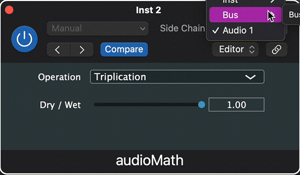

# audioMath  
  
  
audioMath is Sidechain VST/Audio Unit plugin that applies mathematical functions to the two input signals to create a unique output  
  
## Installing  
Open the .jucer file, select the exporter that matches your IDE and click the export button, then build.  
*audioMath was programmed and built in Xcode.*  
  
## Function Options  
audioMath currently has 7 distinct functions. The main signal will be represented by "m" and the sidechain input will be represented by "s"  
  
- **Multiplication** -> sin(m * |s| * π / 2)  
  
- **Sin Multiply** -> sin(m * π) * sin(s * π)  
  
- **Minimum** -> *This option means closest to zero, rather than the true minimum.* Outputs whichever signal is closer to zero.  
  
- **Maximum** -> *This option means furthest from zero, rather than the true maximum.* Outputs whichever signal is further from zero.  
  
*Both Minimum and Maximum output lots of distortion. The true minimum/maximum is not used to prevent high amounts of only positive/negative values*
  
- **Plus*Minus** -> (m + s) * (m - s)  
  
- **Triplication** -> (m + s) * (m - s) * (s - m)  
  
- **SinTan** -> -sin(tan(m + s)) * sin(tan(m - s)) * sin(tan(s - m))  
  
## JUCE
[JUCE](https://juce.com) - JUCE is the most widely used framework for audio application and plug-in development. It is an open source C++ codebase that can be used to create standalone software on Windows, macOS, Linux, iOS and Android, as well VST, VST3, AU, AUv3, AAX and LV2 plug-ins.
